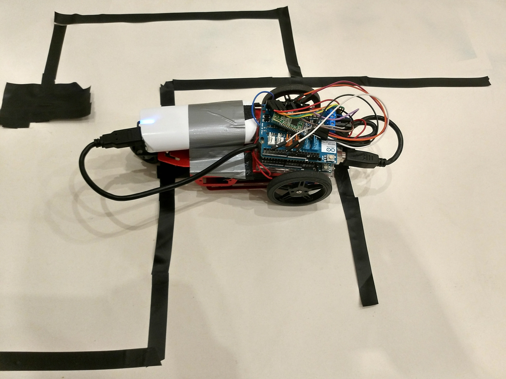
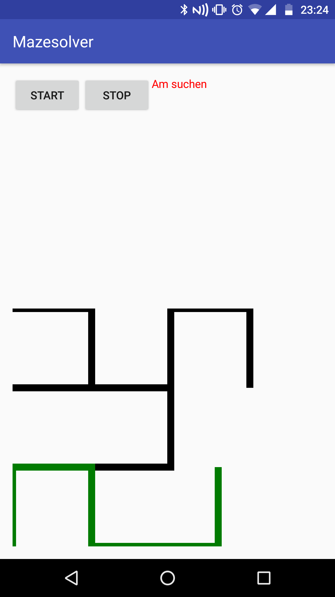

# maze-solving
### An Arduino based robot that uses an array of infrared-sensors to drive through a maze

We have also build an Android app to connect to the Arduino via Bluetooth in order to display the maze.

